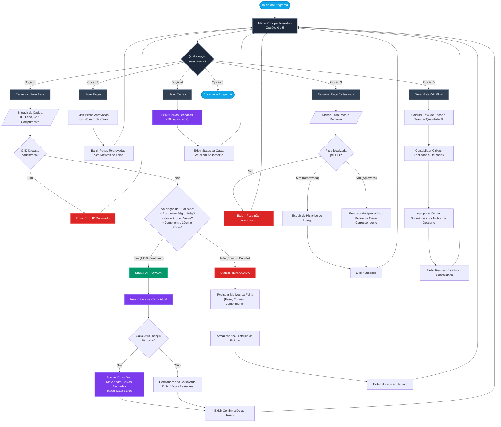

# Fluxograma do Sistema: Automação Digital e Controle de Qualidade

**Aluno:** João Pedro Gomes da Silva  
**Matrícula:** 284437  
**Disciplina:** Algoritmos e Lógica de Programação  
**Instituição:** Centro Universitário UniFECAF  

> [!TIP]
> **Como visualizar o fluxograma na IDE:**  
> Pressione **`Ctrl + Shift + V`** (ou clique no ícone de lupa/pré-visualização **"Open Preview to the Side"** no canto superior direito do editor) para abrir o renderizador nativo de Markdown e ver o diagrama completo interativo.

---

## Fluxograma Geral (Flowchart TD)

---

## Resumo das Decisões e Entidades

| Decisão / Ação | Condição | Resultado Lógico |
| :--- | :--- | :--- |
| **Aprovação da Peça** | `95.0 <= peso <= 105.0` e `cor in ['azul', 'verde']` e `10.0 <= comp <= 20.0` | Peça aprovada e direcionada à caixa |
| **Reprovação da Peça** | Qualquer condição violada | Registro da não conformidade na lista de refugo |
| **Fechamento de Caixa** | `len(caixa_atual) == 10` | Caixa é selada, adicionada a `caixas_fechadas` e nova caixa vazia é aberta |
| **Remoção de Peça** | ID existente na lista | Exclusão do cadastro e readequação de caixas |
